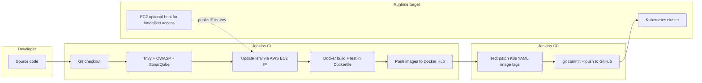

# DevSecOps Pipeline Project — End-to-End Technical Explanation

This document describes the **DevSecOps-Pipeline** repository: a full-stack blog-style application (“Wanderlust” theme) with **continuous integration (CI)**, **continuous delivery / GitOps-style CD**, **containerization**, **Kubernetes manifests**, and **AWS infrastructure as code**. It is written for a technical audience (e.g., a teacher or examiner).

---

## 1. High-level purpose

The project demonstrates how software moves from **source code** to **scanned, built container images** to **version-controlled Kubernetes configuration** and finally to **runtime on a cluster**, with security and quality gates in the middle.

In one sentence: **Jenkins automates build and security checks, publishes Docker images to Docker Hub, updates Kubernetes YAML in Git with new image tags, and the app runs on Kubernetes (with MongoDB and Redis) on infrastructure that can be provisioned with Terraform on AWS.**

---

## 2. Application architecture (what the software does)

### 2.1 Frontend

- **Technology:** React 18, TypeScript, Vite, Tailwind CSS, React Router.
- **Features (routes):** Home, add blog, post details, sign-in, sign-up; shared layout with header/footer patterns and scroll behavior.
- **HTTP client:** Axios talks to the backend API.
- **Configuration:** `VITE_API_PATH` (in `.env.docker` for containers) points the browser to the backend base URL.
- **Quality:** ESLint, Prettier, Jest + React Testing Library for unit/integration-style tests.

### 2.2 Backend

- **Technology:** Node.js, **Express**, ES modules (`"type": "module"` in `package.json`).
- **Data:** **MongoDB** via **Mongoose** (posts, users).
- **Caching:** **Redis** — read-through cache middleware on selected post routes (`cacheHandler`) to reduce database load for “all posts,” “featured,” and “latest.”
- **Auth:** Email/password plus OAuth-style flows for Google and GitHub (routes under `/api/auth`).
- **API surface:** `/api/posts` (CRUD and filtered reads), `/api/auth` (sign-in/up/out and OAuth callbacks).
- **Cross-cutting:** `cors`, `cookie-parser`, `compression`, JSON body parsing.
- **Quality:** Jest + Supertest for unit/integration tests; ESLint and Prettier.

### 2.3 Data stores

- **MongoDB:** Primary document store for application data.
- **Redis:** Cache layer; keys defined in `backend/utils/constants.js` and used by `cacheHandler` in `backend/utils/middleware.js`.

### 2.4 Local orchestration (developer machine)

**`docker-compose.yml`** defines:

| Service   | Role |
|-----------|------|
| `mongodb` | MongoDB, port `27017`, volume for `./backend/data` |
| `redis`   | Redis 7 Alpine |
| `backend` | Built from `./backend`, env from `backend/.env.docker`, host port `31100` → container `8080` |
| `frontend`| Built from `./frontend`, env from `frontend/.env.docker`, Vite dev server on `5173` |

The **root `package.json`** uses **concurrently** to run frontend and backend together via `npm run start` for local development without Docker.

---

## 3. Container images (Docker)

### 3.1 Backend Dockerfile (multi-stage)

1. **Builder stage (`node:21`):** Copies code, runs `npm i`, runs **`npm run test`** — tests must pass before a production-ish image is produced.
2. **Runtime stage (`node:21-slim`):** Copies the built context from the builder, adds `.env.docker` as `.env`, exposes **8080**, starts with `npm start` (nodemon in dev-oriented setup).

### 3.2 Frontend Dockerfile (multi-stage)

1. **Builder:** Installs dependencies and copies source; comment structure implies a build-oriented flow, but the **final image** copies the full app from the builder and runs **`npm run dev` with `--host`** on port **5173** (development server inside the container, suitable for demos; production would typically `npm run build` and serve static files with nginx or similar).

### 3.3 Image registry

CI pushes images to **Docker Hub** under the namespace **`avash9857`** with repositories:

- `dev-sec-ops-backend-beta`
- `dev-sec-ops-frontend-beta`

Tags are **parameterized** (e.g., `v13`) and passed from Jenkins into build and push steps.

---

## 4. Continuous Integration (CI) — root `Jenkinsfile`

The pipeline uses a **Jenkins Shared Library** (`@Library('Shared') _`) so repetitive steps (`code_checkout`, `trivy_scan`, `docker_build`, etc.) live in a **separate repository** — a **DRY (Don’t Repeat Yourself)** practice.

### 4.1 Parameters

- **`FRONTEND_DOCKER_TAG`** and **`BACKEND_DOCKER_TAG`** — required; empty values fail the pipeline early (“Validate Parameters”).

### 4.2 Stages (in order)

1. **Workspace cleanup** — `cleanWs()` to reduce disk use on the agent.
2. **Git checkout** — Clones `https://github.com/Avashneupane9857/DevSecOps-Pipeline/` branch `master` (via shared library).
3. **Trivy filesystem scan** — Container/image security scanning (vulnerabilities in dependencies and filesystem).
4. **OWASP Dependency-Check** — Known-vulnerability analysis for project dependencies.
5. **SonarQube analysis** — Static analysis and code quality metrics (project/key names passed into shared library).
6. **SonarQube Quality Gate** — Build can fail if quality thresholds are not met.
7. **Parallel environment update (AWS + `.env`)**  
   - `Automations/updatebackendnew.sh` — Uses **AWS CLI** (`ec2 describe-instances`) for a fixed **instance ID** to get the instance **public IPv4**, then updates **`backend/.env.docker`** so `FRONTEND_URL` matches `http://<ip>:5173`.  
   - `Automations/updatefrontendnew.sh` — Same IP discovery, updates **`frontend/.env.docker`** so `VITE_API_PATH` matches `http://<ip>:31100`.  
   This ties **frontend ↔ backend URLs** to the **current EC2 public IP** when the pipeline runs (useful when the app is accessed via NodePorts on that host).
8. **Docker check** — Verifies Docker CLI availability (`docker version`, `docker info`).
9. **Docker build** — Builds backend and frontend images with the parameterized tags.
10. **Docker push** — Pushes both images to Docker Hub.

### 4.3 Post-build (CI success)

- **Archives artifacts** matching `*.xml` (often reports from OWASP or similar tools).
- **Triggers a downstream CD job** named **`DevSecOps-Pipeline-CD`**, passing the same **frontend and backend image tags** as parameters.

So: **CI = security + quality + build + push; CD is a separate Jenkins job.**

---

## 5. Continuous Delivery / GitOps-style CD — `GitOps/Jenkinsfile`

This pipeline implements **configuration-driven deployment** by **changing Git**, not by kubectl from Jenkins (though an operator or sync tool could apply manifests afterward).

### 5.1 Flow

1. Clean workspace, checkout same repository.
2. **Verify** parameters echo the image tags.
3. **Patch Kubernetes manifests with `sed`**  
   - `kubernetes/backend.yaml` — replaces the image reference `avash9857/dev-sec-ops-backend-beta:<tag>` with the new **`BACKEND_DOCKER_TAG`**.  
   - `kubernetes/frontend.yaml` — same for `dev-sec-ops-frontend-beta` and **`FRONTEND_DOCKER_TAG`**.
4. **Verify** — Prints updated `backend.yaml` and `frontend.yaml` to the console log.
5. **Git commit and push** — Uses Jenkins credentials (`github` Git username/password), runs `git add .`, `git commit`, `git push` to `master` on GitHub.

### 5.2 Notifications

On **success** and **failure**, **`emailext`** sends HTML email with build metadata and attaches the log (sender/recipient configured in the Jenkinsfile).

**Teaching point:** This is **GitOps-flavored**: the **desired state** (image versions) is recorded in Git; something else (human, Argo CD, Flux, or a manual `kubectl apply`) must apply it to the cluster.

---

## 6. Kubernetes (`kubernetes/`)

All listed resources use **namespace `wanderlust`**.

### 6.1 Backend (`backend.yaml`)

- **Deployment** `backend-deployment`: 1 replica, container image from Docker Hub (e.g., `avash9857/dev-sec-ops-backend-beta:v13`), container port **8080**.
- **Service** `backend-service`: **NodePort**, port 8080 → target 8080, **nodePort 31100** (matches local/docker-compose host mapping concept).

### 6.2 Frontend (`frontend.yaml`)

- **Deployment** `frontend-deployment`: 1 replica, image `avash9857/dev-sec-ops-frontend-beta:<tag>`, container port **5173**.
- **Service** `frontend-service`: **NodePort**, **nodePort 31000**.

### 6.3 MongoDB (`mongodb.yaml`)

- **Deployment** with `mongo` image, port 27017, **volumeMount** `/data/db` backed by PVC `mongo-pvc`.
- **ClusterIP Service** `mongo-service` on 27017 for in-cluster DNS (`mongo-service.wanderlust.svc`).

### 6.4 Redis (`redis.yaml`)

- **Deployment** with `redis` image, port 6379.
- **Service** `redis-service` on 6379.
- **Note:** The manifest mounts a volume named `mongo-storage` from the same PVC as MongoDB; the mount path points at a **file path** for dump — this is unconventional for Redis persistence and worth discussing in class as a **design / correctness** topic (Redis typically uses a directory for data or a dedicated volume).

### 6.5 Storage (`persistentVolume.yaml`, `persistentVolumeClaim.yaml`)

- **PV** `mongo-pv`: 5Gi, `ReadWriteOnce`, **hostPath** `/data/db` on the node.
- **PVC** `mongo-pvc`: 5Gi, `ReadWriteOnce`, empty `storageClassName` (binds to static PV in many setups).

**Teaching point:** `hostPath` ties data to **one node**; for production, use a cloud volume (EBS, EFS) and a **StorageClass**.

### 6.6 Cluster setup documentation (`kubernetes/kubeadm.md`)

Step-by-step **kubeadm** install for **Kubernetes 1.29**:

- Docker on nodes, **swap off**, kernel modules (`overlay`, `br_netfilter`), sysctl for bridging/IP forward.
- **CRI-O** as container runtime, then **kubelet/kubeadm/kubectl** from Kubernetes package repos.
- **Master:** `kubeadm init`, kubeconfig for user, **Calico** CNI from upstream manifest, token for workers.
- **Workers:** join with printed `kubeadm join` command.

---

## 7. Infrastructure as Code — Terraform (`terraform/`)

### 7.1 Provider

- **AWS** provider version **5.65.0**, region from variable (default **`ap-southeast-2`**).

### 7.2 Resources (`ec2.tf`)

- **`aws_key_pair`:** SSH key named `terra-automate-key`, public key loaded from `terraform-key.pub` (path in repo is machine-specific in the current `file()` call — normally teams use variables or CI secrets).
- **`aws_default_vpc`:** Uses the default VPC.
- **`aws_security_group`:** Ingress **22, 80, 443** from **`0.0.0.0/0`**; egress all. **SSH open to the world is a security risk** — good exam question: restrict to your IP or use a bastion.
- **`aws_instance`:** AMI `ami-0f5d1713c9af4fe30`, type **`t2.large`**, 30 GB **gp3** root volume, tag name `Automate`.

### 7.3 Variables (`variables.tf`)

- `aws_region`, `ami_id`, `instance_type` — parameterized for reuse.

**Teaching point:** `terraform.tfstate` in the repo holds **real infrastructure state**; best practice is **remote state** (S3 + locking) and **not committing secrets or state** if it contains sensitive outputs.

---

## 8. End-to-end flow (summary diagram)

---

## 9. Security & DevSecOps themes (what to tell your teacher)

| Practice | Where it appears |
|----------|------------------|
| **Shift-left scanning** | Trivy (fs), OWASP Dependency-Check, SonarQube in CI |
| **Quality gates** | SonarQube “quality gate” stage fails the pipeline if standards aren’t met |
| **Immutable artifacts** | Versioned Docker images tagged per release/build |
| **Separation of CI and CD** | CI job triggers CD job only on success |
| **Shared library** | Reduces duplication and centralizes integration with tools |
| **Secrets & config** | `.env.docker` / env files for runtime config (ensure secrets are not committed — use `.env.sample` patterns) |
| **Hardening opportunities** | Terraform SG rules (SSH), committed state/keys, Redis/Mongo volume layout — valid topics for “what would you improve?” |

---

## 10. How to run locally (short reference)

- **Docker Compose:** From repo root: `docker compose up --build` (requires Docker).  
- **Without Docker:** `npm run installer` then `npm run start` (frontend + backend); ensure MongoDB and Redis match `MONGODB_URI` and `REDIS_URL` in backend env.

---

## 11. File map (quick index)

| Path | Role |
|------|------|
| `Jenkinsfile` | CI: security scans, build, push, trigger CD |
| `GitOps/Jenkinsfile` | CD: patch K8s manifests, git push, email |
| `docker-compose.yml` | Local multi-container stack |
| `backend/`, `frontend/` | Application source and Dockerfiles |
| `Automations/*.sh` | EC2 public IP → update `.env.docker` files |
| `kubernetes/*.yaml` | Deployments, Services, PV/PVC |
| `kubernetes/kubeadm.md` | Manual cluster bootstrap |
| `terraform/` | AWS EC2 + key pair + security group |

---

## 12. Suggested “oral exam” talking points

1. **Why multi-stage Dockerfiles?** Smaller final images; backend runs tests in builder before copying artifacts.  
2. **Why Jenkins Shared Library?** One place to fix checkout/scan/docker logic for many pipelines.  
3. **Why NodePort?** Simple exposure on cluster nodes for demos; production often uses Ingress + TLS or a cloud load balancer.  
4. **What is GitOps here?** Git becomes the source of truth for **which image version** runs; CD automates updating that truth.  
5. **What would you add next?** Automated `kubectl apply` or Argo CD; private registry; secrets via Kubernetes Secrets or external secret managers; tighten security groups; separate Redis persistence from Mongo PVC.

---

*Generated as project documentation for teaching and demonstration. Adjust any public URLs, instance IDs, or registry names if your deployment differs from the committed examples.*
